---
outline:
  level: [2, 3, 4]
---

# How to deploy an AWS ECR hosted image in AWS ECS

This how-to assumes:

- Basic [familiarity with System Initiative](../tutorials/getting-started)
- Are familiar with [AWS ECR](https://docs.aws.amazon.com/ecr) and
  [AWS ECS](https://docs.aws.amazon.com/ecs)
- Have [docker cli](https://docs.docker.com/reference/cli/docker/) installed
  locally
- You have completed the
  [build an AWS VPC with System Initiative tutorial](./aws-vpc) (and not deleted
  the resulting resources)

It will teach you how to deploy an AWS ECR Repository, build and push a docker
container to it, then deploy that application on AWS ECS with System Initiative.

We will cover:

- The creation of an ECR Repository
- The creation of an ECS cluster with a deployed service
- An AWS Application Load Balancer
- The networking required to allow the ECS service to service traffic to the
  load balancer

## Setup

All activities in this how-to happen within an AWS Region and AWS Credential.

Start in a Change Set named `ECR Infrastructure How-to`.

## Walkthrough

### What it will look like

When you are through with this guide, you should have Components that look like
this in your Diagram:

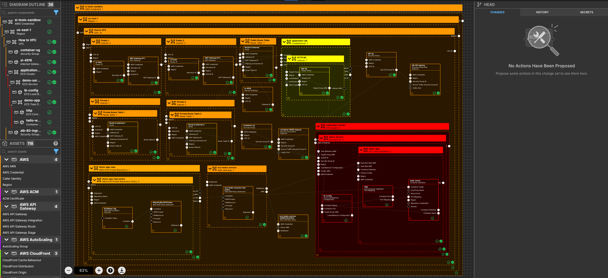

### Create AWS Credentials

Add a `AWS Credential` to your Change Set and configure your AWS credentials

### Select an AWS Region

Add a `AWS Region` to your Change Set and set the `region` property to
`us-east-1`.

### Create an ECR Repository

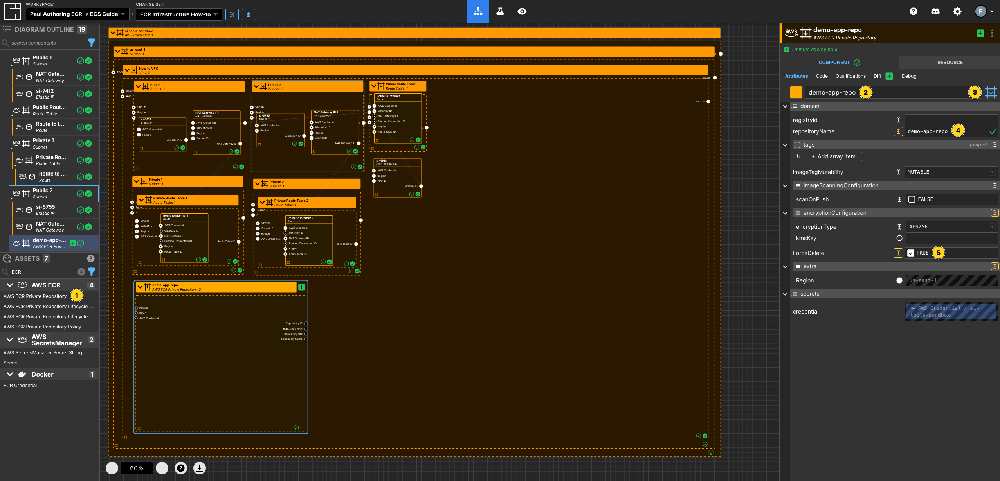

Add an `ECR Private Repository` to your `us-east-1` region frame.

Set the Component name to be `demo-app-repo policy`.

Set the Component type to be `Configuration Frame (down)`.

Set the `repositoryName` to be `demo-app-repo`.

Set `ForceDelete` to be `true`.

### Create an ECR Repository Policy

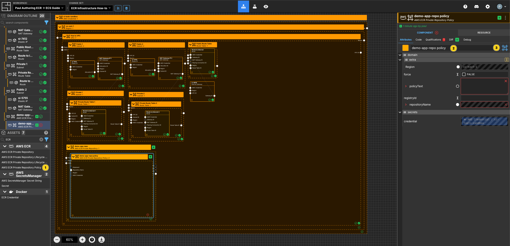

Add an `ECR Repository Policy` to your `demo-app-repo` repository frame.

Set the Component name to be `demo-app-repo policy`

Set the Component type to be `Configuration Frame (up)`.

### Create an IAM Condition Operator

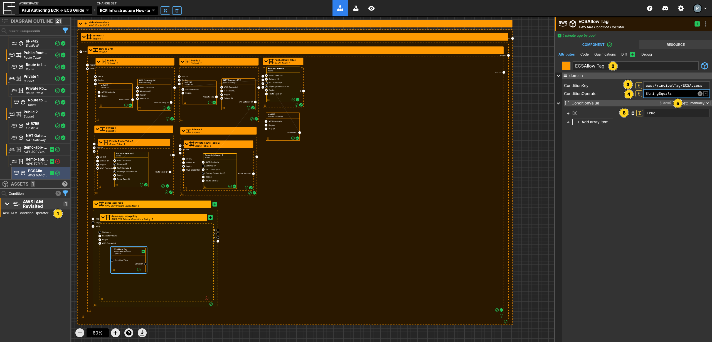

Add an `IAM Condition Operator` to the `demo-app-repo policy` frame.

Set Component name to be `ECSAllow Tag`.

Set the `ConditionKey` to be `aws:PrincipalTag/ECSAccess`

Set the `ConditionOperator` to be `StringEquals`.

Set the `ConditionValue` to be `set manually`.

Add an array item to `ConditionValue`.

Set the value to be `True`.

### Create an IAM Policy Statement

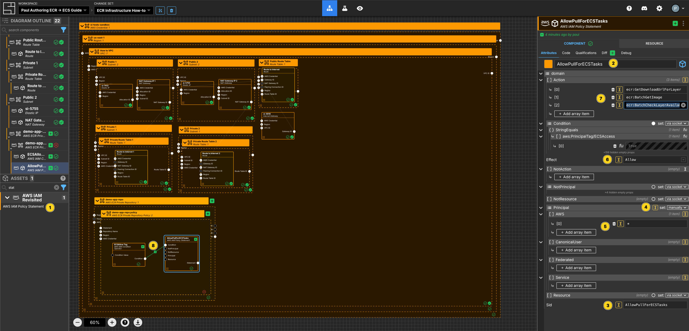

Add an `IAM Policy Statement` to the `demo-app-repo policy` frame.

Set the Component name to be `AllowPullForECSTasks`

Set the `Sid` to be `AllowPullForECSTasks`

Set the `Principal` to be `set manually`.

Add an array item to the `AWS` section.

Set the value to be `*`.

Set `Effect` to be `Allow`

Add 3 array items to `Action`

Set the values to be:

- `ecr:GetDownloadUrlForLayer`
- `ecr:BatchGetImage`
- `ecr:BatchCheckLayerAvailability`

Connect the `Condition` Output Socket of the `ECSAllow Tag` Component to the
`Condition` Input Socket of this `AllowPullForECSTasks` Component.

### Apply your ECR Infrastructure Change Set

Press `Escape` or click anywhere on the canvas background to select the
Workspace.

Click the `Apply Change Set` button to:

- Create an ECR Private Repository
- Create an ECR Private Repository Policy

### Build & Push Docker Image

The demo application to deploy in ECS is
[infrastructureascode/hello-world](https://hub.docker.com/r/infrastructureascode/hello-world).
This is a very simple app that returns `Hello, World!` message at the `/` path
and has a `/metrics` and a `/health` endpoint.

Firstly, `docker pull` this container locally:

```
docker pull infrastructureascode/hello-world
```

Go to the `Resource` tab of the `demo-app-repo` Component and select
`Resource Data`. This data includes the `repositoryUri`.

Next, `docker tag` the image for the ECR container created:

```
docker tag infrastructureascode/hello-world 'repositoryUri':latest
```

Note: the use of `repositoryUri`. Ensure the correct data from the
`Resource Data` is added to this command.

Next, `docker login` to the ECR repository, similar to the following:

```
aws ecr get-login-password --region us-east-1 | docker login --username AWS
--password-stdin 573113295293.dkr.ecr.us-east-1.amazonaws.com
```

Note: You must be authenticated to the correct AWS account to run this command.
You can find the accountId from the `repositoryUri`.

Lastly, `docker push` the image:

```
docker push 'repositoryUri':latest
```

### Create a new Change Set

Create a new Change Set called `ECS Infra`.

### Create a Loadbalancer Component

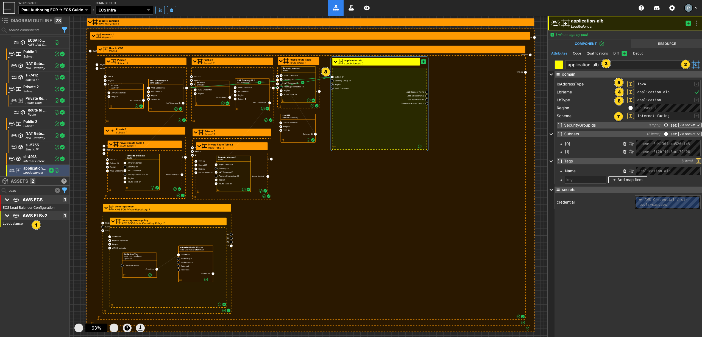

Add a `Loadbalancer` to your `VPC How-to` vpc frame.

Set the Component type to be `Configuration Frame (down)`.

Set the Component name to `application-alb`.

Set the `LbName` to `application-alb`.

Set the `IpAddressType` to be `ipv4`.

Set the `LbType` to be `application`.

Set the `Scheme` to be `internet-facing`.

Connect the `Subnet ID` Output Socket of each of the public subnet Components to
the `Subnet ID` Input Socket of the `application-alb` Component.

### Create a Security Group Component for the Loadbalancer

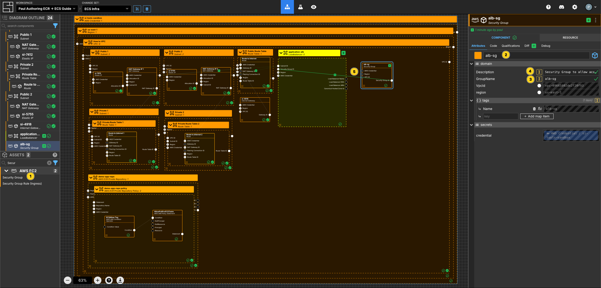

Add a `Security Group` to your `VPC How-to` vpc frame.

Set the Component name to `alb-sg`.

Set the `GroupName` to `alb-sg`.

Set the `Description` to be `Security Group to allow access to the Loadbalancer`

Connect the `Security Group ID` Output Socket of `alb-sg` Component to the
`Security Group ID` Input Socket of the `application-alb` frame.

### Create an Ingress Rule Component

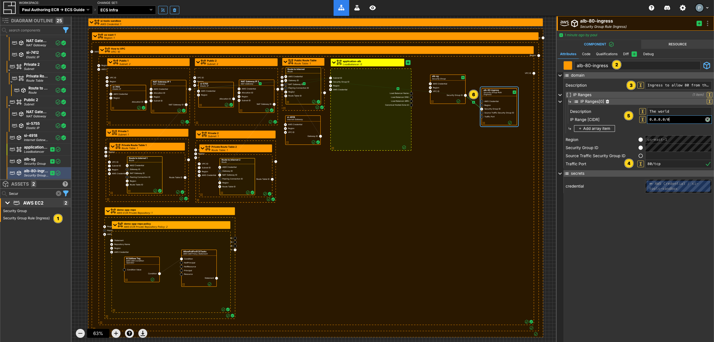

Add a `Security Group Rule (Ingress)` to your `VPC How-to` vpc frame.

Set the Component name to be `alb-80-ingress`.

Set the `Description` to be `Ingress to allow 80 from the world`.

Set the `TrafficPort` to be `80/tcp`.

Add an `IpRange` array item.

Set the `IP Range [CIDR]` to be `0.0.0.0/0` and the `Description` to be
`The world`.

Connect the `Security Group ID` Output Socket of `alb-sg` Component to the
`Security Group ID` Input Socket of this `alb-80-ingress` Component.

### Create a Listener Components

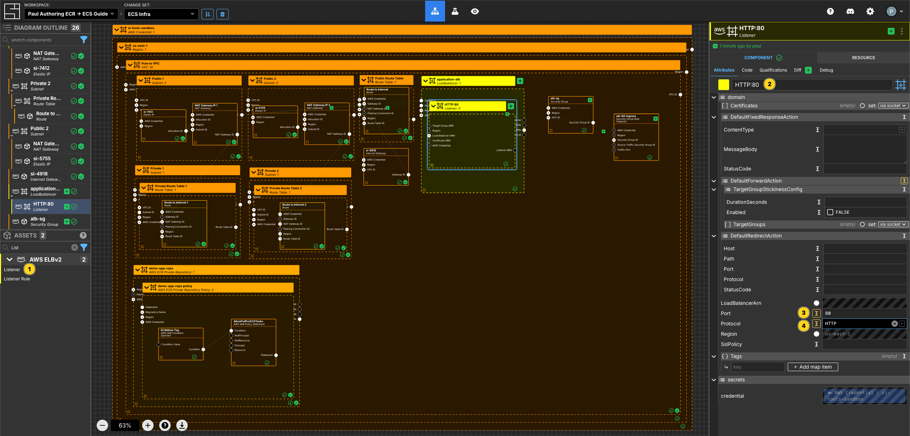

Add a `Listener` Component to your `application-alb` loadbalancer frame.

Set the Component name to `HTTP:80`.

Set the `Port` to be `80`.

Set the `Protocol` to be `HTTP`.

Resize the frame to be large enough to fit another Component.

### Create a Target Group

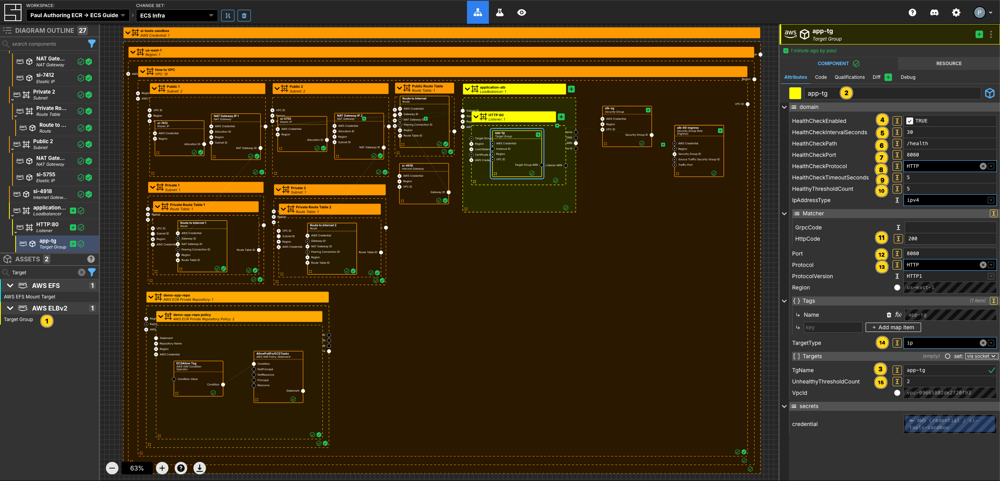

Add a `Target Group` Component to your `Listener` frame.

Set the Component name to `app-tg`.

Set `TgName` to be `app-tg`.

Set `HealthCheckEnabled` to be enabled.

Set `HealthCheckIntervalSeconds` to `30` seconds.

Set `HealthCheckPath` to be `/health`.

Set `HealthCheckPort` to be `8080`.

Set `HealthCheckProtocol` to be `HTTP`.

Set `HealthCheckTimeoutSeconds` to be `5`.

Set `HealthyThresholdCount` to be `5`.

Set `HttpCode` to be `200`.

Set `Port` to be `80`.

Set `Protocol` to be `HTTP`.

Set `TargetType` to be `ip`.

Set `UnhealthyThresholdCount` to be `2`.

Connect the `Target Group ARN` Output Socket of `app-tg` Component to the
`Target Group ARN` Input Socket of the `HTTP:80` frame.

### Create an IAM Role

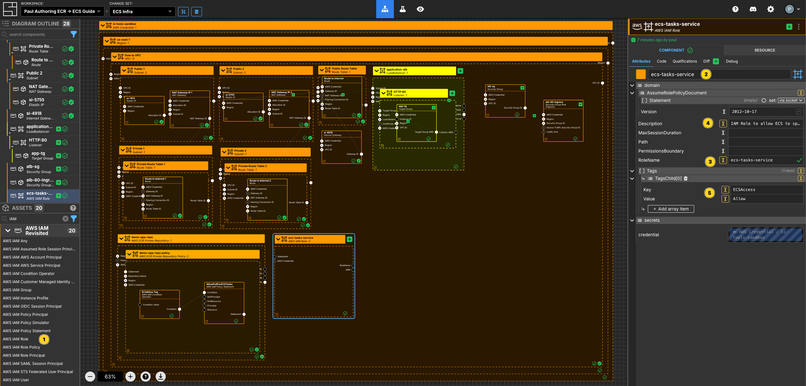

Add an `AWS IAM Role` Component to your `VPC How-to` vpc frame.

Set the Component name to `ecs-tasks-service`.

Set the `RoleName` to `ecs-tasks-service`.

Set the `Description` to `IAM Role to allow ECS to spawn tasks`.

Add an array item to `Tags`.

Set the `Key` to be `ECSAccess`

Set the `Value` to be `Allow`

### Create an AWS IAM Policy Statement

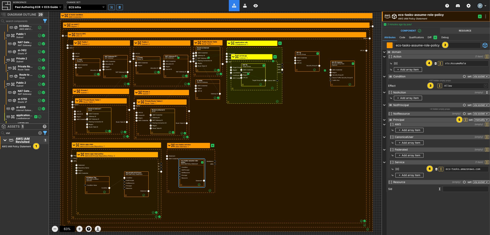

Add an `AWS IAM Policy Statement` within the `ecs-tasks-service` AWS IAM Role
frame.

Set the Component name to `ecs-tasks-assume-role-policy`.

Set the `Effect` to `Allow`.

Add an array item to the `Action` array.

Set the `[0]` value for the `Action` array to `sts:AssumeRole`.

Set the `Principal` to be `set manually`.

Add an array item to the `Service` section.

Set the value to be `ecs-tasks.amazonaws.com`.

### Create a Security Group Component for the Application

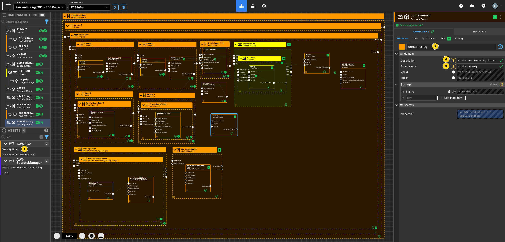

Add a `Security Group` to your `VPC How-to` vpc frame.

Set the Component name to `container-sg`

Set the `GroupName` to `container-sg`.

Set the `Description` to be `Container Security Group`

### Create an Ingress Rule Component for the Application

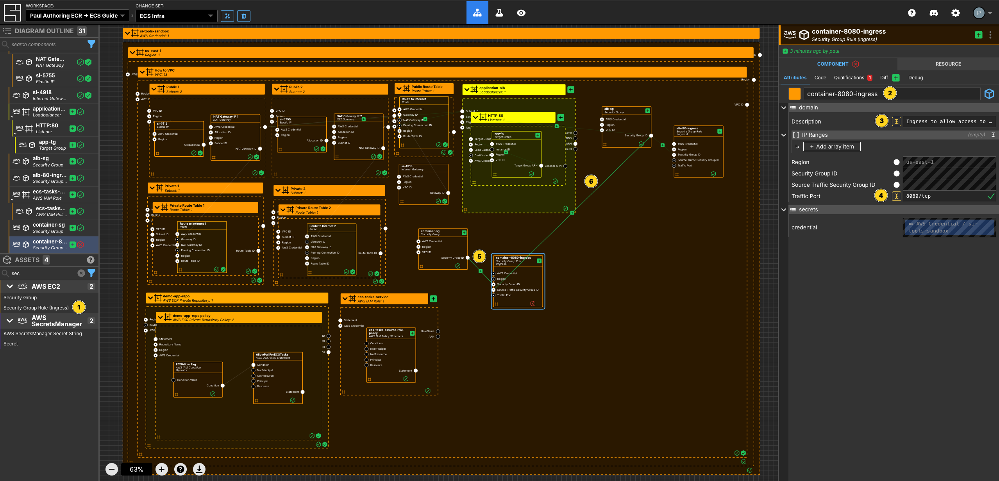

Add a `Security Group Rule (Ingress)` to your `VPC How-to` vpc frame.

Set the Component name to be `container-8080-ingress`.

Set the `Description` to be `Ingress to allow access to port 8080`.

Set the `TrafficPort` to be `8080/tcp`.

Connect the `Security Group ID` Output Socket of `container-sg` Component to the
`Security Group ID` Input Socket of this`container-80-ingress` Component.

Connect the `Security Group ID` Output Socket of `alb-sg` Component to the
`Source Traffic Security Group ID` Input Socket of this `container-80-ingress`
Component.

### Create an ECS Cluster

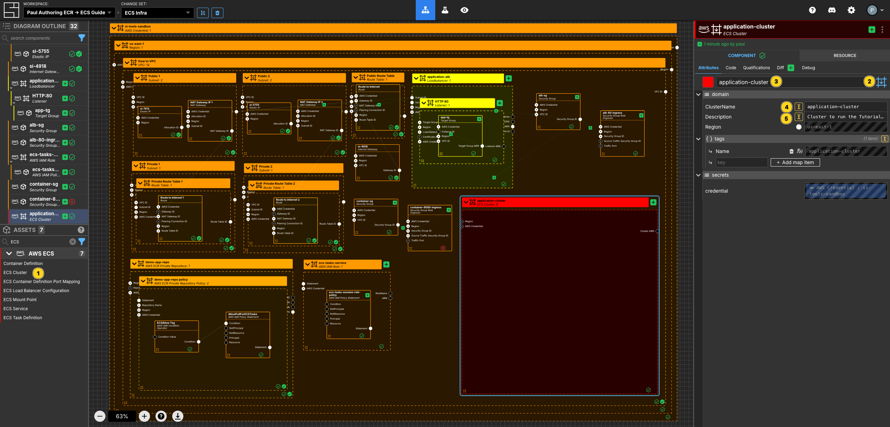

Add an `ECS Cluster` to your `VPC How-to` vpc frame.

Set the Component type to be `Configuration Frame (down)`.

Set the Component name to `application-cluster`.

Set the `ClusterName` to `application-cluster`.

Set the `Description` to be `Cluster to run the Tutorial App`

### Create an ECS Service

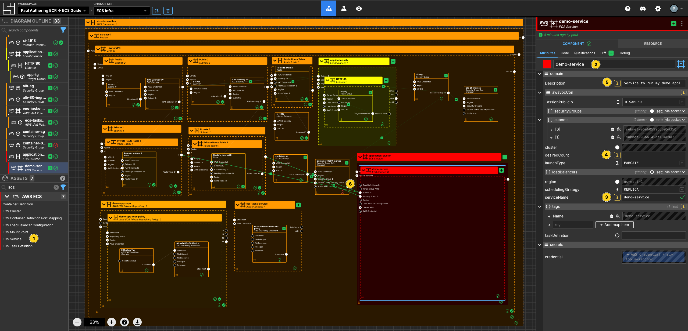

Add an `ECS Service` to your `application-cluster` cluster frame.

Set the Component name to `demo-service`.

Set the `serviceName` to `demo-service`.

Set the `desiredCount` to be `1`.

Set the `description` to be `Service to run my demo application`.

Connect the `Subnet ID` Output Socket of each of the private subnet Components
to the `Subnet ID` Input Socket of this `demo-service` Component.

Connect the `Security Group ID` Output Socket of `container-sg` Component to the
`Security Group ID` Input Socket of this `demo-service` Component.

### Create an ECS Task Definition

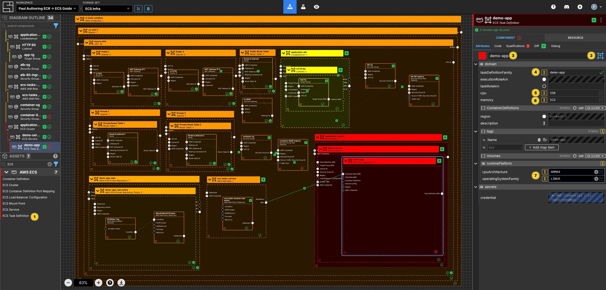

Add an `ECS Task Definition` to your `demo-service` service frame.

Set the Component type to be `Configuration Frame (up)`.

Set the Component name to `demo-app`.

Set the `taskDefinitionFamily` to be `demo-app`.

Set `cpu` to be `0.25 vCPU`.

Set `memory` to be `.5 GB`.

Set the `runtimePlatform` based on the architecture of the container image.

Connect the `ARN` Output Socket of the `ecs-tasks-service` AWS IAM Role to the
`Task Role ARN` Input Socket of your `demo-app` ECS Task Definition.

### Create a Container Definition

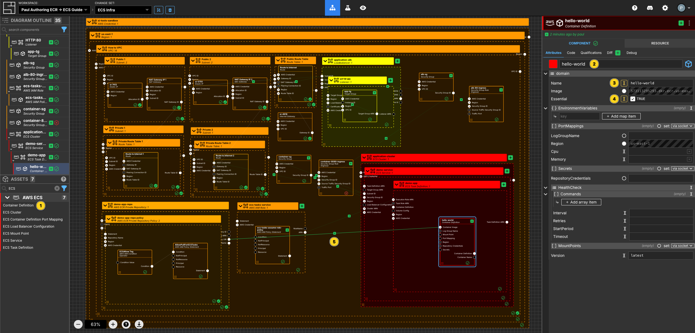

Add a `Container Definition` to your `demo-app` frame.

Set the Component name to `hello-world`.

Set `Name` to `hello-world`.

Set `Essential` to be selected.

Connect the `Repository Uri` Output Socket of the `demo-app-repo` to the
`Container Image` Input Socket of this `hello-world` container definition.

### Create an ECS Container Definition Port Mapping


Add a `ECS Container Definition Port Mapping` to the `demo-app` frame.

Set the Component name to be `http`.

Set the `name` to be `http`.

Set the `containerPort` to be `8080`.

Set the `hostPort` to be `8080`.

Set the `protocol` to be `tcp`.

Connect the `Port Mapping` Output Socket of this `http` ECS Container Defintion
Port Mapping to the `Port Mapping` Input Socket of the `hello-world` Container
Defintion.

### Create a ECS Load Balancer Configuration


Add a `ECS Load Balancer Configuration` to the `demo-service` frame.

Set the Component name to be `lb-config`.

Connect the `Target Group ARN` Output Socket of the `app-tg` Target Group to the
`Target Group ARN` Input Socket of this `lb-config` Component.

Connect the `Container Name` Output Socket of the `hello-world` Container
Defintion to the `Container Name` Input Socket of this `lb-config` Component.

Connect the `Container Port` Output Socket of the `http` ECS Container Defintion
Port Mapping to the `Container Port` Input Socket of this `lb-config` Component.

### Create an IAM Role Policy

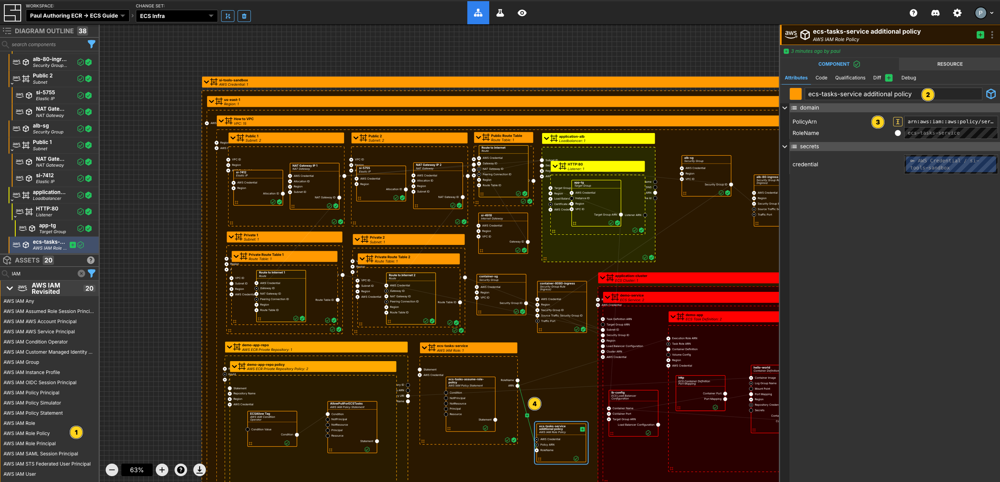

Add a `IAM Role Policy` to the `How to VPC` frame.

Set the Component name to be `ecs-tasks-service additional policy`

Set the `PolicyArn` to be
`arn:aws:iam::aws:policy/service-role/AmazonECSTaskExecutionRolePolicy`

Connect the `RoleName` Output Socket of the `ecs-tasks-service` IAM Role to the
`RoleName` Input Socket of this `ecs-tasks-service additional policy` Component.

### Apply your Change Set

Press `Escape` or click anywhere on the canvas background to select the
Workspace.

Click the `Apply Change Set` button to:

- Create 2 Security Groups and associated ingress rules
- Create an application load balancer, a listener and a target group
- Create an IAM Role and IAM Instance Profile
- Create an ECS Cluser and the associated service with a running task

### Explore your resources

Review the completed AWS resources by clicking the `Resource` sub-panel for each
of your new resources.

Select the `application-alb` Component on the Model. Go to the `Resource Data`
screen and you will find the `DNSName`. You can visit that URL in the browser
and inspect the running application.

### Clean Up

Create a new Change Set called `Clean up How-to`

Delete your `VPC How-to` VPC frame. All of the Components inside will be marked
for deletion.

Click `Apply Change Set`.

All your new resources should be deleted from your AWS account.

## Vocabulary
In this guide bits of System Initiative Vocabulary will be shown with a capital letter. 
All definitions for these can be found here: [System Initative - Vocabulary](https://docs.systeminit.com/reference/vocabulary) 