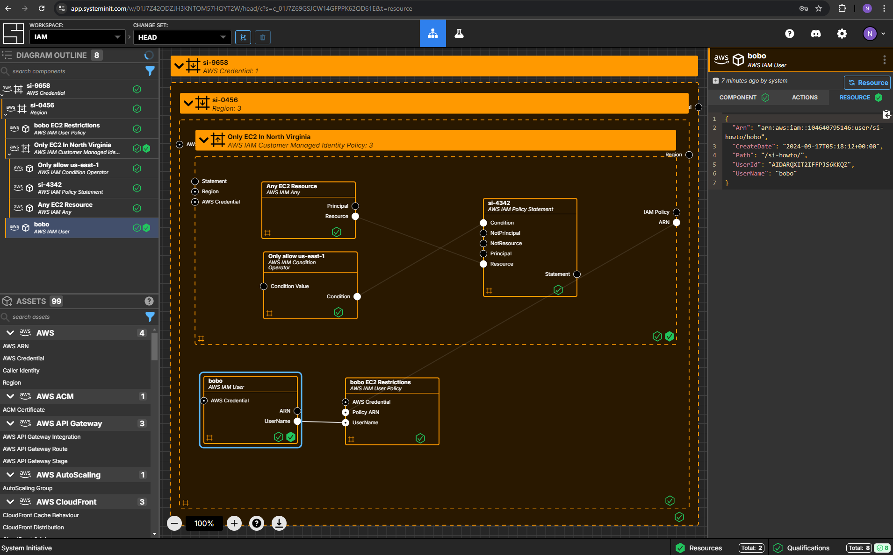
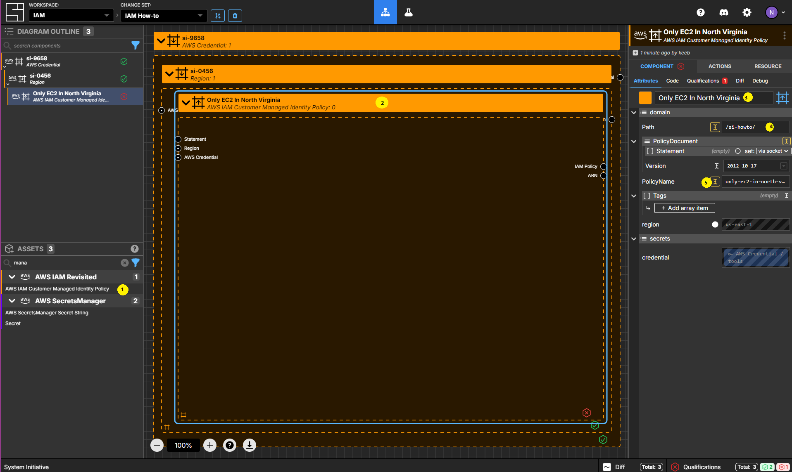
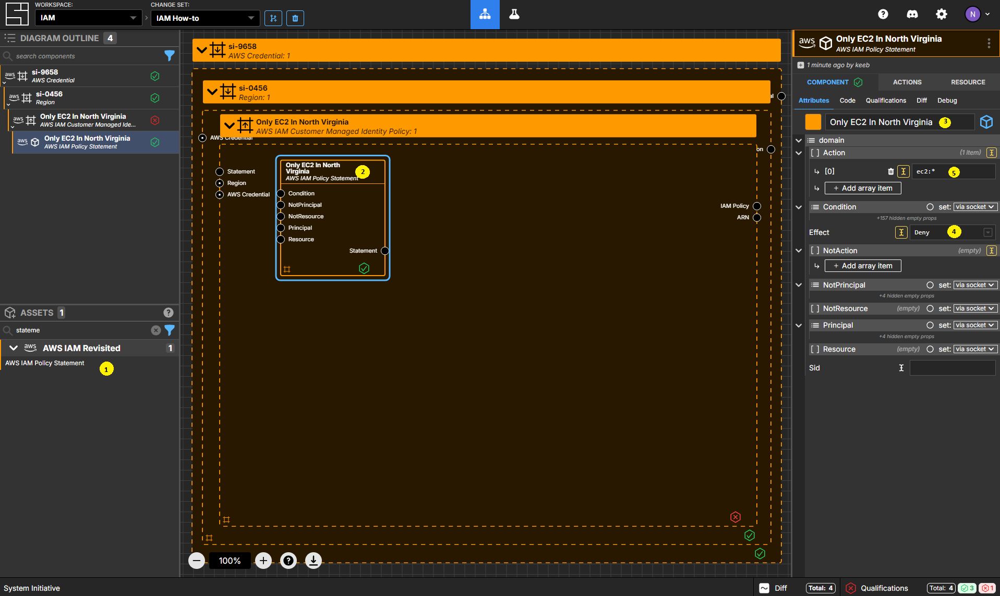
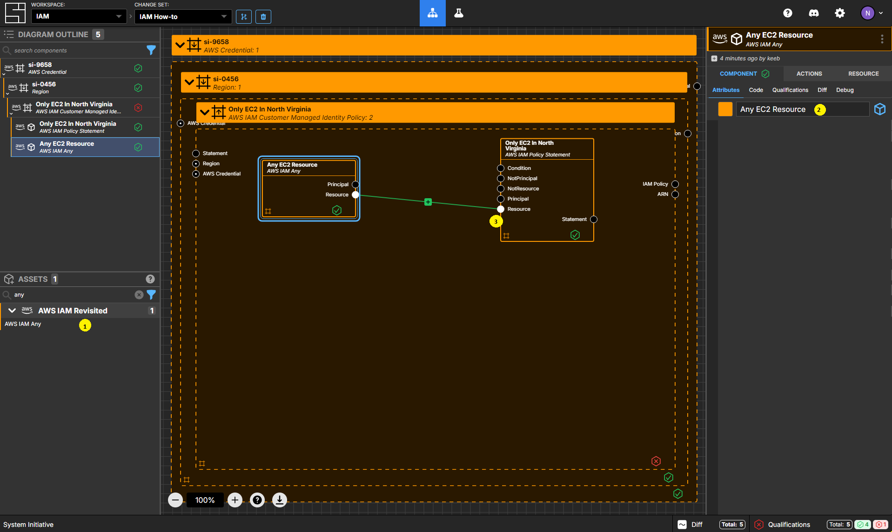
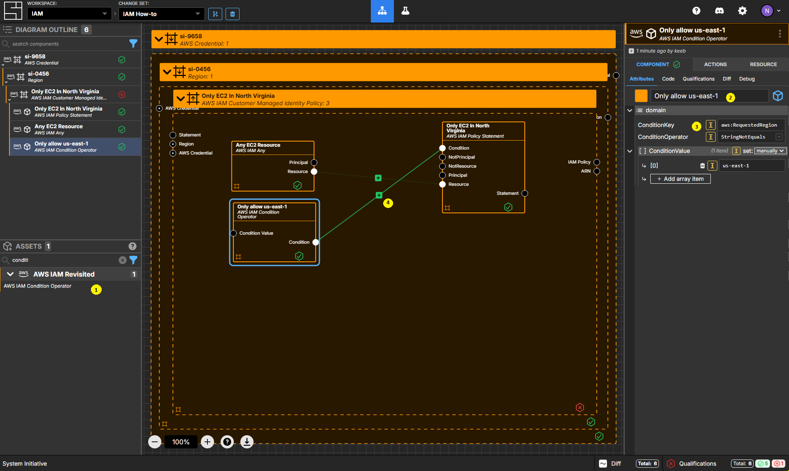
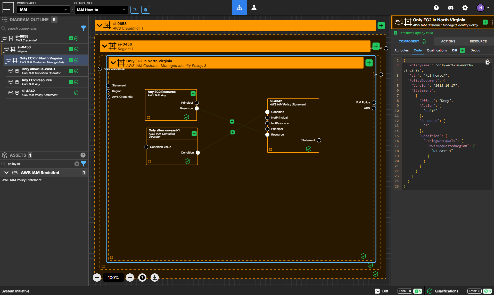
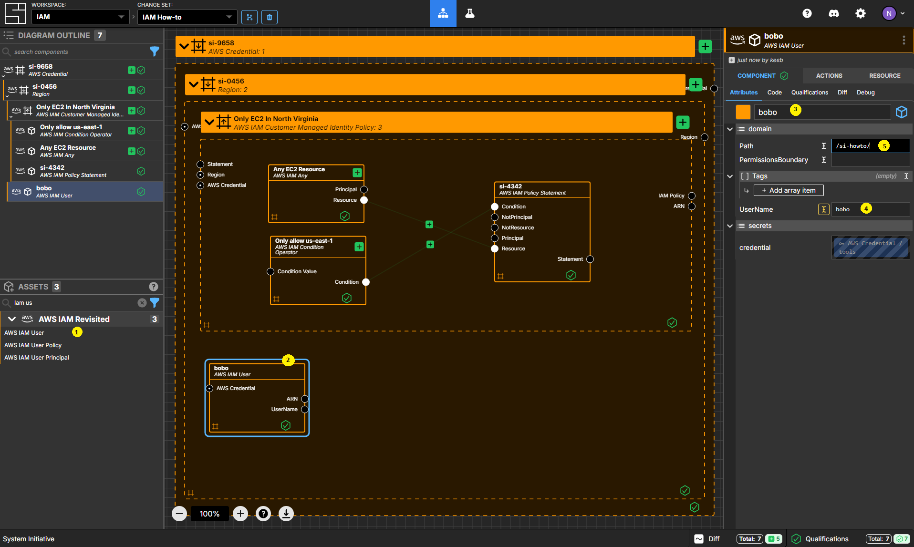

---
outline:
  level: [2, 3, 4]
---

# How to manage AWS IAM Policy

This how-to assumes:

- Basic [familiarity with System Initiative](../tutorials/getting-started)
- Are familiar with [AWS IAM](https://docs.aws.amazon.com/iam/)

It will teach you how to create an AWS IAM policy and manage it with System
Initiative.

We will cover:

- Creating a customer managed identity policy
- Adding complex statements to the policy
- Attaching our policy to a user
- Using the AWS ARN component to manipulate ARNs

We will be creating a policy to
[restrict EC2 access to a specific region](https://docs.aws.amazon.com/AWSEC2/latest/UserGuide/ExamplePolicies_EC2.html).

## Setup

All activities in this how-to happen within a configured AWS Region and AWS
Credential.

Start in a change set named `IAM How-to`. See the [AWS VPC How To](./aws-vpc.md)
for instructions on how to set this up.

## Walkthrough

### What it will look like

When you are through with this guide, you should have components that look like
this in your diagram:



### Create an AWS IAM Customer Managed Identity Policy component



You can learn more about
[Customer Managed Identity Policies in the AWS documentation](https://docs.aws.amazon.com/IAM/latest/UserGuide/access_policies_managed-vs-inline.html#customer-managed-policies).

Add an AWS IAM Customer Managed Identity Policy to your `Region` frame.

Set the components name to `Only EC2 In North Virginia`.

Set the `Path` to `/si-howto/`.

Set the `PolicyName` to `only-ec2-in-north-virginia`

### Create an AWS IAM Policy Statement component



Add an `AWS IAM Policy Statement` to your `Only EC2 In North Virginia` policy
frame.

Set the name to `Only EC2 In North Virginia`.

Set the `Effect` to `Deny`.

Add an item to the `Action` array, and set the value `ec2:*`.

### Create an AWS IAM Any component



Add an `AWS IAM Any` component inside your `Only EC2 In North Virginia` policy
frame.

Set the name to `Any EC2 Resource`.

Connect the `Resource` output socket to the `Resource` input socket of your
`Only EC2 In North Virginia` statement.

### Create an AWS IAM Condition Operator component



Add an `AWS IAM Condition Operator` component inside your
`Only EC2 In North Virginia` policy frame.

Set the name to `Only allow us-east-1`.

Set the `ConditionOperator` to `StringNotEquals`.

Set the `ConditionKey` to `aws:RequestedRegion`.

Change the `ConditionValue` from being set via socket to being set `manually`.

Add an item to the `ConditionValue` array, and set the value to `us-east-1`.

Connect the `Condition` output socket to the `Condition` input socket of your
`Only EC2 In North Virginia` statement.

### Review your policy



Select your `Only EC2 In North Virginia` policy frame.

Navigate to the `Code` sub-panel. You should see JSON that looks like the
following:

```json
{
  "PolicyName": "Only EC2 In North Virginia",
  "Path": "/si-howto/",
  "PolicyDocument": {
    "Version": "2012-10-17",
    "Statement": [
      {
        "Effect": "Deny",
        "Action": ["ec2:*"],
        "Resource": ["*"],
        "Condition": {
          "StringNotEquals": {
            "aws:RequestedRegion": ["us-east-1"]
          }
        }
      }
    ]
  }
}
```

Your components should be passing all their
[qualifications](/reference/vocabulary#Qualification).

### Create an AWS IAM User component



Add an `AWS IAM User` to your `Region` frame. (It should be a peer of your
`Only EC2 In North Virginia` policy.

Set the name to `bobo`.

Set the `UserName` to `bobo`.

Set the `Path` to `/si-howto/`.

### Create an AWS IAM User Policy component


Add an `AWS IAM User Policy` component to your `Region` frame.

Set the name to `bobo EC2 Restrictions`.

Connect the `UserName` output socket of your `bobo` AWS IAM User to the
`UserName` input socket of your `bobo EC2 Restrictions` AWS IAM User Policy.

Connect the `ARN` output socket of the `Only EC2 In North Virginia` AWS IAM
Customer Managed Identity Policy to the `Policy ARN` input socket of your
`bobo EC2 Restrictions` AWS IAM User Policy.

### Apply your Change Set


Press `Escape` or click anywhere on the canvas background to select the
Workspace.

Click the `Apply Change Set` button to:

- Create your new Identity Policy
- Create the bobo user
- Attach your policy to your policy

### Explore your resources


Review the completed AWS resources by clicking the `Resource` sub-panel for each
of your new resources.

### Clean Up

Create a new change set called `Clean up IAM How-to`

Delete your `Only EC2 In North Virginia` policy frame.

Delete your `bobo` AWS IAM User.

Delete your `bobo EC2 Restrictions` AWS IAM Policy.

Click `Apply Change Set`.

All your new resources should be deleted from your AWS account.

## Advanced Topics

### Complex Resource ARNs

You may need to create more complex array's of Resource ARNs for a given policy
statement. For example, to allow a policy to apply to an S3 Bucket and any
contents of the bucket.

#### Create an S3 Bucket Component

Create a new Change Set called `Complex ARN Example`.

Add an `S3 Bucket` in your `region` frame.

Set the name to `bobo-logs`.

#### Create an IAM Policy Statement component

Add an `AWS IAM Policy Statement` component within your Region.

Set the name to `Example Policy`.

Connect the `ARN` output socket of `bobo-logs` to the `Resource` input socket of
`Example Policy`.

#### Create an AWS ARN component

Add an `AWS ARN` component within your Region.

Set the name to `bobo-logs/*`.

Connect the `ARN` output socket of `bobo-logs` to the `ARN` input socket of
`bobo-logs/*`.

Set the `resource-postfix` to `/*`.

Connect the `ARN` output socket of `bobo-logs/*` to the `Resource` input socket
of `Example Policy`.

#### Examine the Example Policy

Go to the Code sub-panel of the `Example Policy`. You'll see that there are now
two resources - the first is the ARN for the S3 bucket itself, and the second
has `/*` appended to it.

You can use this style to override or extend any ARN.

#### Clean up

Abandon your `Complex ARN Example` change set.
