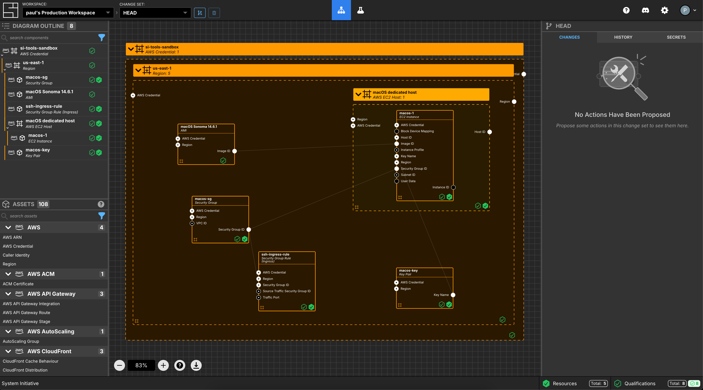
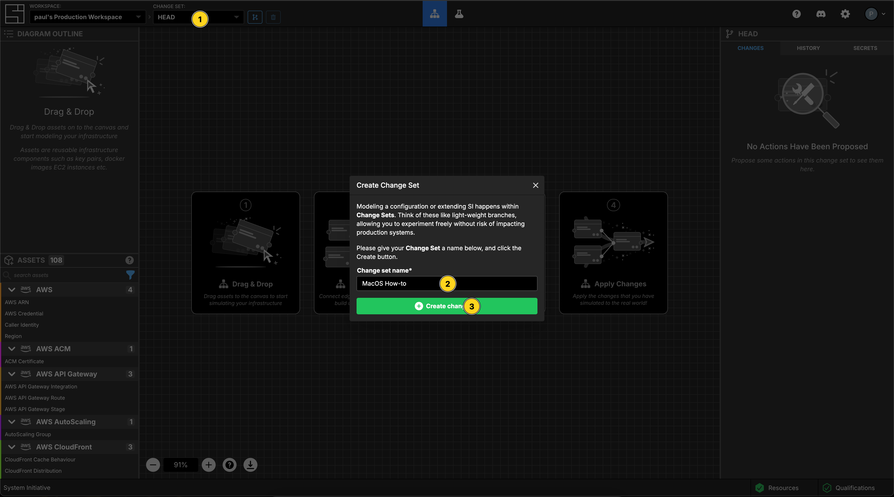
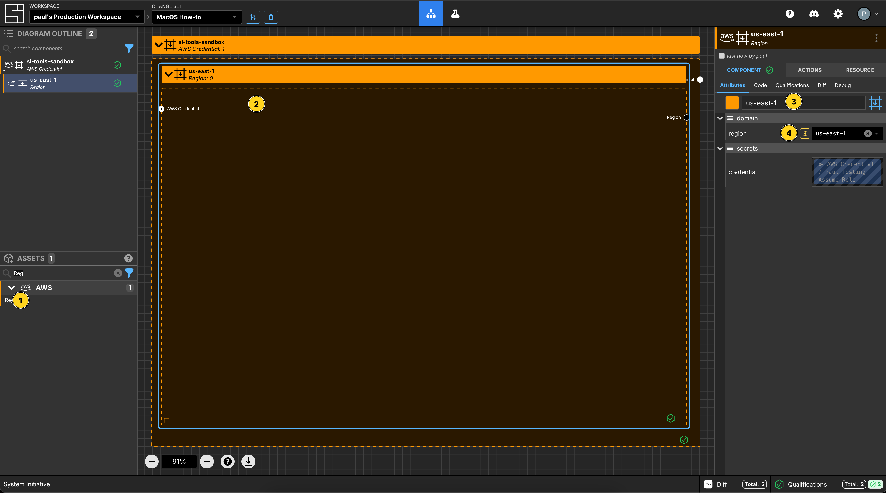
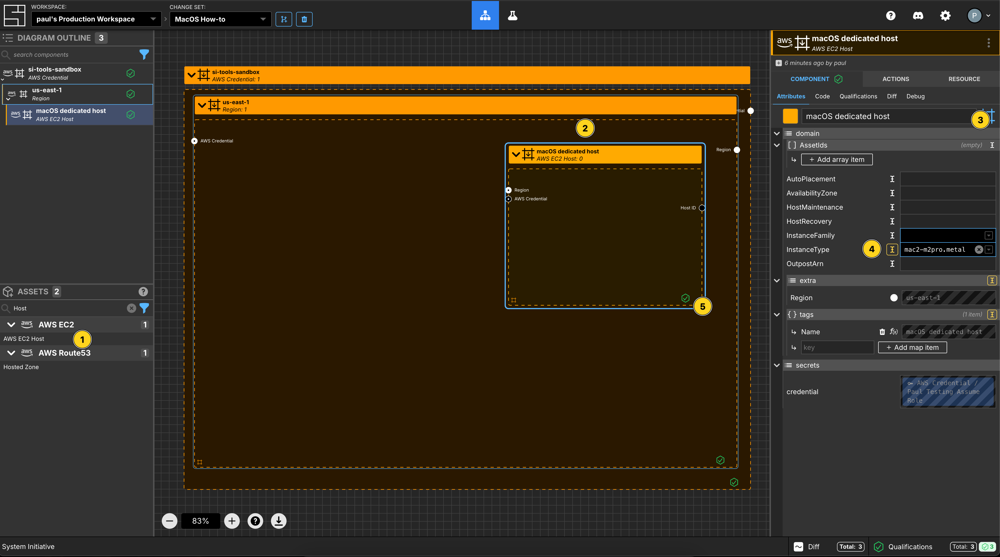
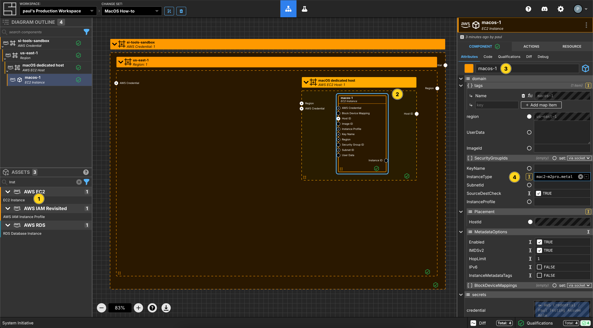
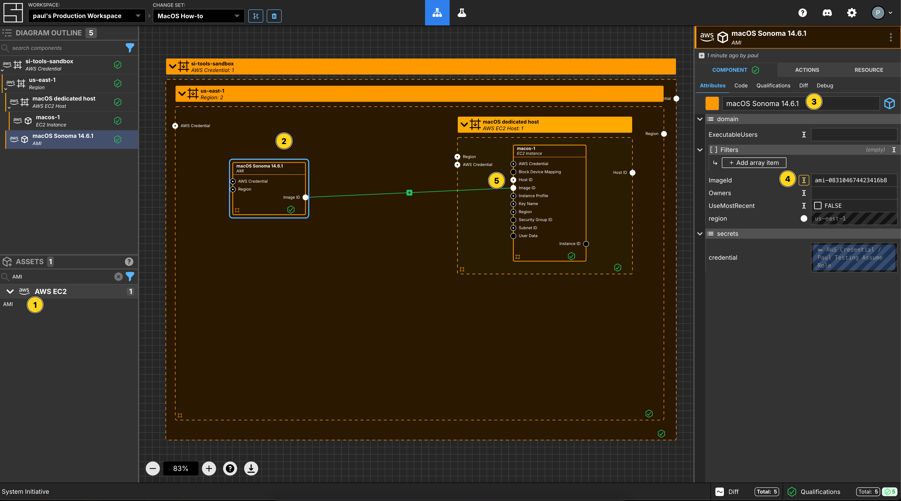
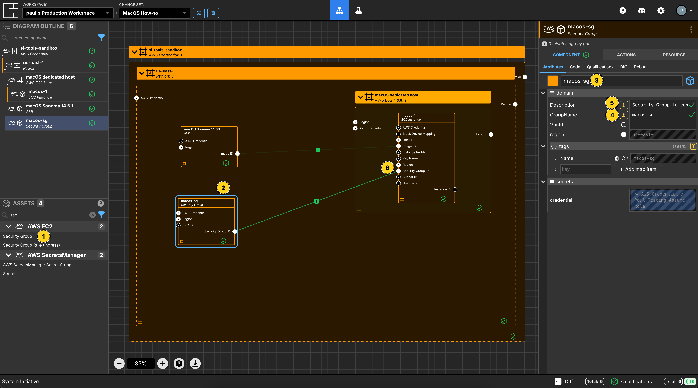
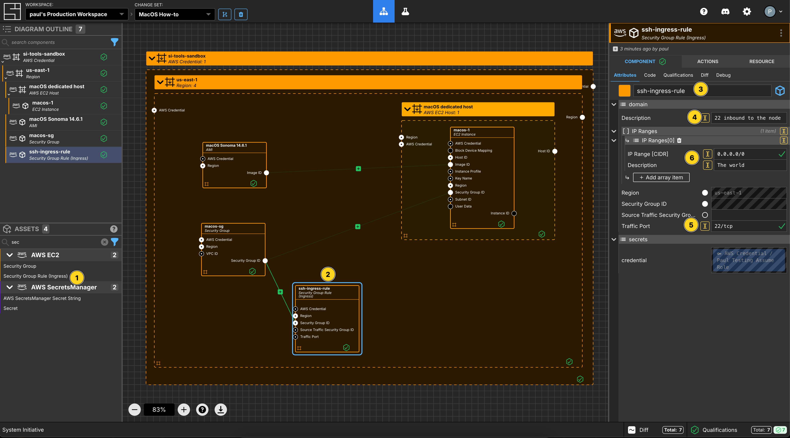
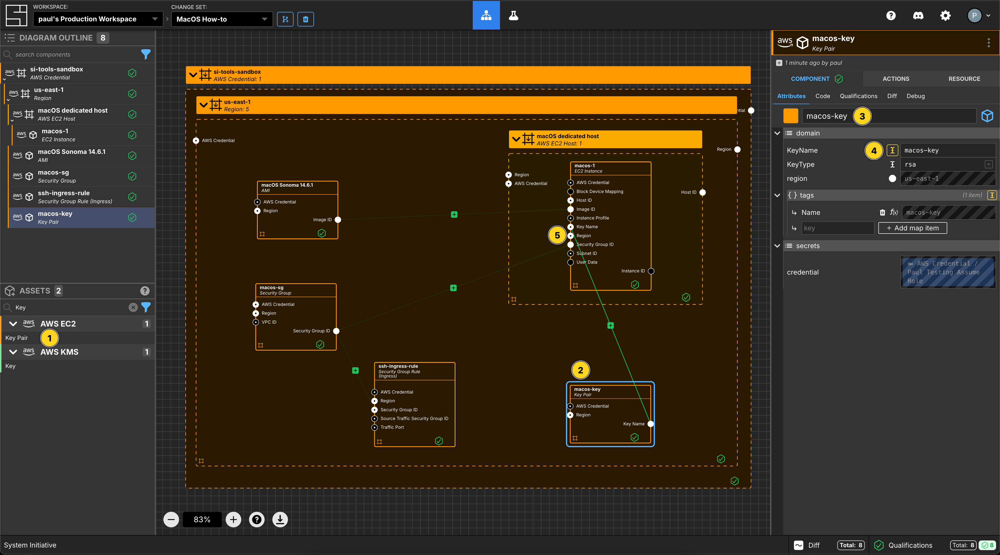
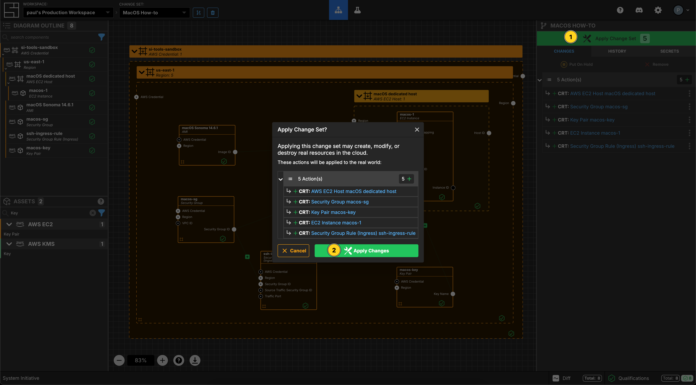

---
outline:
  level: [2, 3, 4]
---

# How to create macOS instances on AWS EC2

This how-to assumes:

- Basic [familiarity with System Initiative](../tutorials/getting-started)
- Are familiar with [AWS EC2](https://docs.aws.amazon.com/ec2/)

It will teach you how to create a dedicated host in AWS EC2 and deploy a macOS
instance on it with System Initiative.

We will cover:

- The AWS dedicated host, EC2 instance and security group needed for the macOS
  instance
- This guide assumes that you have the
  [AWS default VPC](https://docs.aws.amazon.com/vpc/latest/userguide/default-vpc.html)
  available to deploy into in `us-east-1` of your AWS account

:::tip
The minimum lease on an AWS EC2 Dedicated Host for macOS is 24 hours. So
you will not be able to release the host before the 24 hour period expires.

:::

## What it will look like when completed

When you have completed this guide, you should have components that look like
this in your diagram:

## Walkthrough

### Create a change set

Create a change set named `MacOS How-to`.

### Create AWS Credentials

Add a `AWS Credential` to your change set and configure your AWS credentials as
per the
[getting started guide](./tutorials/getting-started#add-an-aws-credential-component)

### Select an AWS Region

Add a `AWS Region` to your change set.

Set the component name to be `us-east-1`.

Set the `region` property to `us-east-1`.

### Select an EC2 Host Component

Add an `EC2 Host` component to the `us-east-1` frame.

Change the component type to be `Down Frame`.

Set the component name to be `macOS dedicated host`

Set the `InstanceType` to be `mac2-m2pro.metal`.

Set the `AvailabilityZone` to be `us-east-1c`.

Resize the frame to allow space for a child component to be inside it.

### Select an EC2 Instance Component

Add an `EC2 Instance` component to the `macOS dedicated host` frame.

Set the component name to be `macos-1`.

Set the `InstanceType` to be `mac2-m2pro.metal`

### Create an AMI Component

Add an `AMI` component to the `us-east-1` frame.

Set the component name to be `macOS Sonoma 14.6.1`

Set the `ImageId` to be `ami-083104674423416b8`.

Connect the `Image ID` output socket to the `Image ID` input socket of the
`macos-1` component.

### Create a Security Group Component

Add a `Security Group` component to the `us-east-1` frame.

Set the component name to be `macos-sg`.

Set the `GroupName` to be `macos-sg`.

Set the `Description` to be
`Security Group to control access to my macOS instance`.

Connect the `Security Group ID` output socket to the `Security Group ID` input
socket of the `macos-1` component.

### Create a Security Group Ingress Rule Component

Add a `Security Group Rule (Ingress)` component to the `us-east-1` frame.

Set the component name to be `ssh ingress rule`

Set the `Description` to be `22 inbound to the node`.

Set the `TrafficPort` to be `22/tcp`.

Add an `IpRange` array item.

Set the `IP Range [CIDR]` to be `0.0.0.0/0` and the `Description` to be
`The world`.

Connect the `Security Group ID` output socket of `macos-sg` component to the
`Security Group ID` input socket of this `ssh-ingress-rule` component.

### Create a KeyPair Component

Add a `Key Pair` component to the `us-east-1` frame.

Set the component name to be `macos-key`.

Set the `KeyName` to be `macos-key`.

Connect the `Key Name` output socket to the `Key Name` input socket of the
`macos-1` component.

### Apply your Change Set

Press `Escape` or click anywhere on the canvas background to select the
Workspace.

Click the `Apply Change Set` button to:

- Create a Security Group Rule and an Ingress Rule
- Create an Ec2 Dedicated Host and associated Instance
- Create a Key Pair

### Explore your resources

Review the completed AWS resources by clicking the `Resource` sub-panel for each
of your new resources.

### Clean Up

Create a new change set called `Clean up How-to`

Delete your `us-east-1` Region frame. All of the components inside will be
marked for deletion.

Click `Apply Change Set`.

All your new resources should be deleted from your AWS account.
